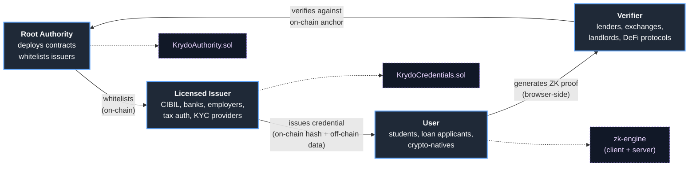
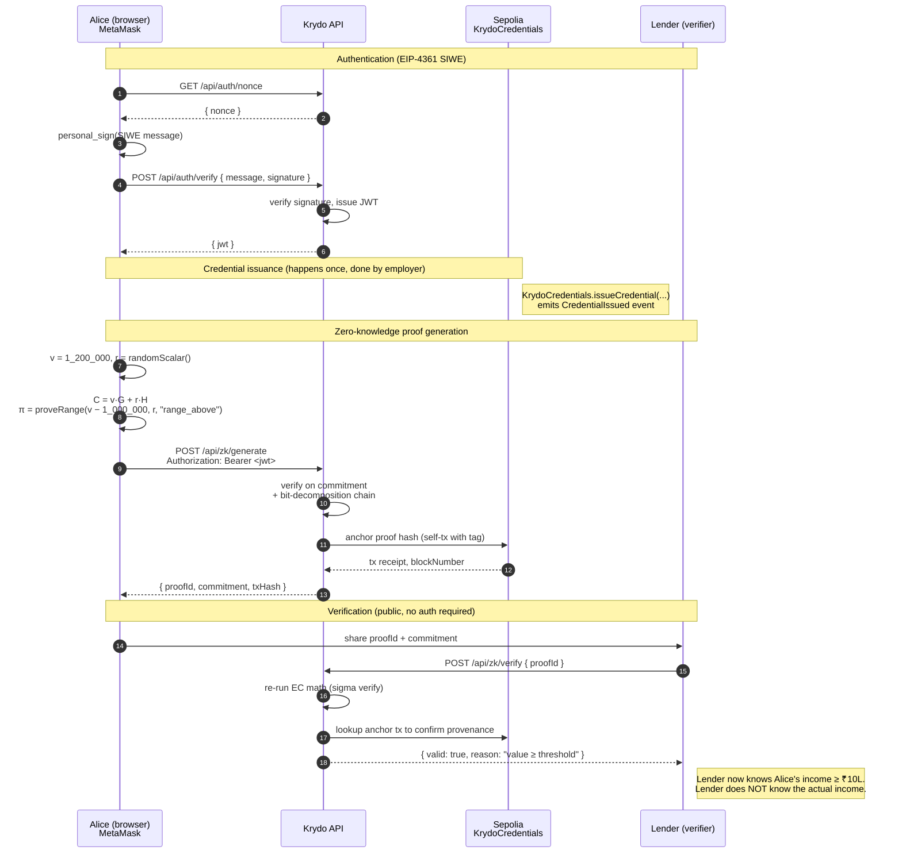

<div align="center">

# Krydo

### Privacy-preserving financial trust infrastructure on Ethereum

**Prove you qualify — without revealing what you have.**

[](https://github.com/nishant-uxs/krydo/actions/workflows/ci.yml)
[](./server/crypto/sigma.test.ts)
[](./LICENSE)
[](https://sepolia.etherscan.io/address/0x0BE4fE934Ff4e9B24186C1cdd0cdFe0594209821)
[](https://www.typescriptlang.org/)
[](./SECURITY.md)

</div>

---

## TL;DR

Krydo lets an Indian college student prove their credit score is above 700 to a lender — **without revealing the score**. Or prove their annual income is above ₹10 lakh — **without revealing the amount**. Or prove they hold a valid KYC credential from a licensed issuer — **without revealing name, Aadhaar, or PAN**.

It does this with real cryptographic **zero-knowledge proofs** (Pedersen commitments + sigma protocols on the same secp256k1 curve Ethereum uses), issued and anchored on Ethereum Sepolia via a three-tier trust hierarchy: **Root Authority → Licensed Issuers → End Users**.

No passwords. No OAuth. No KYC data on our servers in cleartext. Users sign in with their Ethereum wallet (EIP-4361 SIWE), and every sensitive operation is cryptographically authenticated by their private key.

---

## The problem

Every fintech product today makes users hand over raw sensitive data — income proofs, CIBIL reports, bank statements, Aadhaar/PAN numbers — to every third party that asks. That data:

1. **Leaks.** Aadhaar breaches, CIBIL breaches, PAN-linked leaks are now weekly news.
2. **Gets re-sold.** Your loan application data becomes a marketing list.
3. **Is over-collected.** A lender asking "do you earn ≥ ₹10 L?" gets back your *exact* salary, employer, last 6 months of transactions, and PF balance.
4. **Can't be revoked.** Once leaked, it's leaked forever.

The cryptographic answer to this is **zero-knowledge proofs** — prove a *predicate* about your data, not the data itself. The practical blocker has been: no one wants to learn circuits, run trusted-setup ceremonies, or pay SNARK gas. Krydo uses sigma protocols (no trusted setup, no circuits, browser-native) to ship this *today*.

---

## How it works

### The four actors



### End-to-end flow (income verification example)

1. **Employer** (whitelisted issuer) signs a credential: `{ holder: 0xAlice, claimType: "annual_income", claimSummary: "INR 1,200,000" }`. Hash goes on-chain; plaintext goes into the holder's encrypted store.
2. **Alice** wants a loan. Lender asks: "prove you earn ≥ ₹10 L."
3. **Alice's browser** runs `proveRange(1_200_000, blinding, "range_above", threshold=1_000_000)`. Generates a Pedersen commitment `C = v·G + r·H` and a range proof that `C - 1_000_000·G` hides a non-negative value — all without ever sending `1_200_000` anywhere.
4. **Lender** hits `POST /api/zk/verify`. Server re-runs the elliptic-curve math on the commitment + the 32-bit-decomposed range proof and responds *true* or *false*. No one, not even Krydo, sees Alice's real salary.
5. **Audit trail:** the commitment hash is anchored on Sepolia; anyone can later verify the proof existed and was linked to a real issuer-signed credential.

### The same flow as a sequence diagram



---

## What goes on-chain vs off-chain

| Data                                      | On-chain (Sepolia) | Off-chain (Firestore) |
|-------------------------------------------|:------------------:|:---------------------:|
| Issuer whitelist (addr, name, active?)    | ✅                 | mirror                |
| Credential hash (`bytes32`)               | ✅                 | mirror                |
| Credential issuer / holder / claimType    | ✅ (event)         | mirror                |
| Credential **plaintext** (salary, name)   | ❌                 | encrypted + hashed    |
| ZK proof commitment (anchor)              | ✅ (tagged tx)     | full proof            |
| ZK proof witness data                     | ❌                 | ✅                    |
| User/issuer wallet roles                  | ✅ (anchored)      | mirror                |
| Request / approval lifecycle              | ✅ (anchored)      | mirror                |

**Design principle:** blockchain is the source of truth for *what exists* and *who said so*. Firestore is the performance layer for *querying* and *rendering*. Losing Firestore ⇒ UI breaks; on-chain truth is intact.

---

## Zero-knowledge proof system

Not SNARKs. Not hash-masking-pretending-to-be-ZK. **Real sigma protocols over Pedersen commitments on secp256k1**, with Fiat–Shamir for non-interactivity.

| Proof type              | Mechanism                                                                                                   | Example use case                                   |
|-------------------------|-------------------------------------------------------------------------------------------------------------|----------------------------------------------------|
| `range_above`           | Bit-decomposition + per-bit OR proof of `delta = v − t` ∈ [0, 2³²)                                          | "credit score ≥ 700"                               |
| `range_below`           | Same, on `t − v`                                                                                            | "debt ratio ≤ 40%"                                 |
| `equality`              | Reveal blinding factor; verifier re-derives `v·G + r·H`                                                     | "I'm a resident of India"                          |
| `membership`            | k-way OR of Schnorr proofs over `C − s_j·G`                                                                 | "citizenship ∈ {IN, US, UK}"                       |
| `non_zero`              | Reduction to `range_above(1)`                                                                               | "I have a PAN number"                              |
| `selective_disclosure`  | Per-field Pedersen commitments; user opens only the fields they want revealed                               | "reveal name + employer; hide salary + address"    |

**Security:** soundness + honest-verifier zero-knowledge under the discrete-log assumption on secp256k1. Soundness error ≈ 2⁻²⁵⁶ per protocol step. All primitives live in [`server/crypto/`](./server/crypto/) — `ec.ts`, `pedersen.ts`, `sigma.ts` — and are covered by **51 unit tests** (of 105 total).

**Why sigma protocols and not SNARKs?**

|                     | Sigma (chosen)                        | SNARKs                                  |
|---------------------|---------------------------------------|-----------------------------------------|
| Trusted setup       | None                                  | Yes (per-circuit or universal)          |
| Proof size          | ~5–50 KB                              | <1 KB                                   |
| Prover time         | <50 ms (browser)                      | 1–30 s                                  |
| Verifier cost       | Same order as proving                 | O(1), cheap on-chain                    |
| Flexibility         | New predicates = new Solidity? No — stays off-chain verifier     | New predicates = new circuit + ceremony |
| Library maturity    | `@noble/curves` is audited, JS-native | `circom` + `snarkjs` / `halo2` — heavy  |

For Krydo's current off-chain-verifier model, sigma wins on DX, shipping speed, and zero trusted-setup risk. Migration to a Groth16/PLONK on-chain verifier is a future wave, not a blocker.

---

## Security posture

- **Authentication:** EIP-4361 (Sign-In With Ethereum). Server issues a signed JWT on successful `personal_sign` of a nonced SIWE message. No passwords, no sessions-as-cookies, no OAuth. `@/e:/projects/Krydo/Kry-Decentralized-Infra/server/auth/siwe.ts`
- **Authorization:** every mutation is role-gated (`root`, `issuer`, `user`) via `requireAuth` + `requireRole` + `requireSelf` middlewares. `@/e:/projects/Krydo/Kry-Decentralized-Infra/server/auth/jwt.ts`
- **Input validation:** **every** route body/param/query is Zod-validated. No raw `req.body` consumed anywhere. `@/e:/projects/Krydo/Kry-Decentralized-Infra/server/validation/schemas.ts`
- **Rate limiting:** per-IP `express-rate-limit` with a stricter limiter on sensitive ops (ZK proofs, credential issuance).
- **Transport hardening:** Helmet CSP, CORS allowlist, no `x-powered-by`, HSTS in prod.
- **Secrets:** all server-side; `.env` gitignored; JWT/session secrets validated ≥ 32 bytes at startup; Firebase service-account JSON gitignored.
- **Observability:** structured JSON logs via `pino`, per-request `x-request-id`, redacted auth headers.
- **Testing:** 105 unit tests, CI runs on every push/PR.
- **Non-custodial:** server never handles user private keys; all signing happens in MetaMask.
- **Deterministic builds:** contract ABIs + addresses imported from a single JSON source (`contracts/deployment.json`) by *both* server and client — server and browser cannot drift apart on which contract they're talking to.

---

## Tech stack

| Layer                     | Choice                                                           |
|---------------------------|------------------------------------------------------------------|
| Smart contracts           | Solidity 0.8.x, deployed on Sepolia                              |
| On-chain library          | `ethers` v6                                                      |
| Cryptography              | `@noble/curves` (secp256k1), `@noble/hashes` (SHA-256)           |
| Backend                   | Node 20, Express, TypeScript, Zod, pino, Helmet, jsonwebtoken    |
| Database                  | Firebase Firestore (Admin SDK)                                   |
| Frontend                  | React 18, Vite, TanStack Query, shadcn/ui, Tailwind, wouter      |
| Wallet                    | MetaMask (EIP-1193 via `window.ethereum`)                        |
| Auth                      | EIP-4361 SIWE + JWT (`jsonwebtoken`)                             |
| Testing                   | Vitest + `@vitest/coverage-v8`                                   |
| CI                        | GitHub Actions (Node 20, typecheck + test)                       |

---

## Live deployment (Sepolia)

| Contract              | Address                                                                                         |
|-----------------------|-------------------------------------------------------------------------------------------------|
| `KrydoAuthority`      | [`0x0BE4fE934Ff4e9B24186C1cdd0cdFe0594209821`](https://sepolia.etherscan.io/address/0x0BE4fE934Ff4e9B24186C1cdd0cdFe0594209821) |
| `KrydoCredentials`    | [`0xEdb9EB8966053B5dc7C6ec17C65673D919Ea77Cb`](https://sepolia.etherscan.io/address/0xEdb9EB8966053B5dc7C6ec17C65673D919Ea77Cb) |
| Root authority wallet | [`0x4Debe0136310df354CE1E8846799409d37f704cB`](https://sepolia.etherscan.io/address/0x4Debe0136310df354CE1E8846799409d37f704cB) |

---

## Quick start

### Prerequisites

- Node.js **20+**
- A Firebase project with Firestore enabled + an Admin SDK service-account JSON
- An Alchemy API key for **Sepolia**
- A Sepolia wallet funded with test ETH (for issuer / credential operations)
- MetaMask installed in the browser you'll use

### 1. Install

```bash
git clone https://github.com/nishant-uxs/krydo.git
cd krydo
npm install
```

### 2. Configure `.env`

Copy the template and fill in your values:

```bash
cp .env.example .env
```

`.env.example` documents every variable (what it does, where to get it, how to generate secrets). The server validates all required vars at startup via [`server/config.ts`](./server/config.ts) — it will refuse to boot with a helpful error if anything is missing or too short.

### 3. Run

```bash
npm run dev        # dev server with HMR at http://localhost:5000
npm test           # 105 unit tests (~15s)
npm run check      # strict typecheck
npm run build      # production build
npm start          # run built server
```

### 4. (Optional) Re-deploy contracts

Use this only if you want your own Sepolia deployment; by default the app talks to the already-deployed addresses listed above.

```bash
npm run compile:contracts    # solc → contracts/artifacts/
npm run deploy:contracts     # writes contracts/deployment.json
```

---

## Project layout

```
krydo/
├── client/                    # React app (Vite)
│   └── src/
│       ├── lib/contracts.ts   # MetaMask-side contract interactions
│       ├── pages/             # /dashboard /issuers /credentials /zk-proofs ...
│       └── components/
├── server/                    # Express API
│   ├── auth/                  # SIWE + JWT
│   ├── crypto/                # EC math, Pedersen, sigma protocols
│   ├── middleware/            # security, pagination, logging
│   ├── routes/                # issuers, credentials, zk, stats, network
│   ├── validation/            # Zod schemas
│   ├── blockchain.ts          # ethers + contract wrappers
│   ├── storage.ts             # Firestore abstraction
│   └── zk-engine.ts           # high-level proof types
├── shared/
│   ├── contracts.ts           # single source of truth for addresses + ABIs
│   └── schema.ts              # shared TS types for API
├── contracts/                 # .sol sources + deployment.json
├── script/                    # deploy + build scripts
├── .github/workflows/ci.yml   # GitHub Actions pipeline
└── vitest.config.ts
```

---

## Roadmap

### Shipped

- [x] Real ZK primitives on secp256k1 (Pedersen + sigma protocols)
- [x] SIWE authentication + JWT
- [x] Real on-chain block numbers (no mock receipts)
- [x] Helmet + CORS + per-IP rate limiting + Zod everywhere
- [x] Structured logging (pino) + request IDs
- [x] Domain-split routes, cursor pagination, shared contract ABI
- [x] 105 unit tests + GitHub Actions CI

### Next up

- [ ] On-chain Groth16/PLONK verifier contract (O(1) proof verification)
- [ ] WalletConnect v2 / RainbowKit (mobile + hardware wallet support)
- [ ] W3C Verifiable Credentials Data Model v2 compliance + DID interop
- [ ] IPFS/Arweave-backed encrypted credential store (decentralize the off-chain layer)
- [ ] Multi-sig root authority (Safe contract)
- [ ] On-chain revocation registry for ZK proofs
- [ ] Per-claim-type structured Zod schemas (income, credit_score, age…)
- [ ] Subgraph for trust-tree history queries

### Known limitations

Krydo is an **MVP on testnet**. Before mainnet you should expect: a third-party cryptographic audit, a multi-sig root, decentralized credential storage, a gas-cost analysis, and SOC-2 / equivalent for the backend. This repo is a solid engineering base, not a production financial product.

---

## Contributing

See [`CONTRIBUTING.md`](./CONTRIBUTING.md) for the full guide (commit conventions, test bar, code style, PR checklist).

Quick version:

1. Fork + branch (`git checkout -b feat/your-change`)
2. Write tests — every new route needs Zod validation + at least one Vitest spec
3. `npm run check && npm test` must pass
4. Conventional Commits format (`feat(zk):`, `fix(auth):`, …)
5. Open a PR — CI will re-run the same gates

All contributions are reviewed for security first, features second.

**Security disclosures:** please follow [`SECURITY.md`](./SECURITY.md) — do not open public issues for vulnerabilities.

---

## License

[MIT](./LICENSE) © 2026 Krydo contributors

---

<div align="center">

**Built with cryptography, not hype.**

Questions? Open an [issue](https://github.com/nishant-uxs/krydo/issues).

</div>
