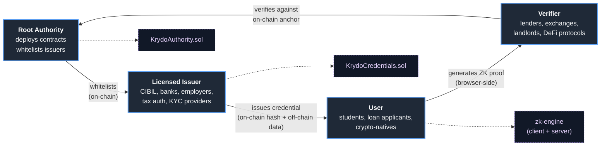
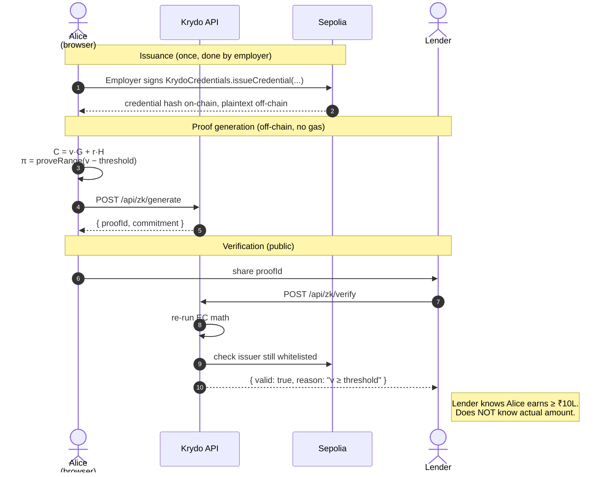
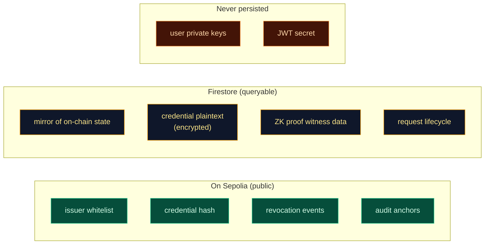

<div align="center">

# Krydo

### Privacy-preserving financial trust infrastructure on Ethereum

**Prove you qualify — without revealing what you have.**

[](https://github.com/nishant-uxs/krydo/actions/workflows/ci.yml)
[](https://krydo.onrender.com)
[](./server/crypto/sigma.test.ts)
[](https://sepolia.etherscan.io/address/0x0BE4fE934Ff4e9B24186C1cdd0cdFe0594209821)
[](./LICENSE)
[](./DOCUMENTATION.md)

**[Full Technical Documentation →](./DOCUMENTATION.md)**

</div>

---

## Overview

| | |
|---|---|
| **Live demo** | https://krydo.onrender.com |
| **Network** | Ethereum Sepolia testnet |
| **Stack** | TypeScript · React · Express · Solidity · Firestore · ethers.js v6 |

**6 sigma-protocol ZK proofs** · **154 unit tests** · **3 Sepolia contracts** · W3C Verifiable Credential export

---

## TL;DR

Krydo is a verifiable-credential system on Ethereum Sepolia. Issuers sign claims into `KrydoCredentials`; holders keep the plaintext off-chain and prove predicates over it with sigma-protocol zero-knowledge proofs (Pedersen commitments on secp256k1, Fiat–Shamir). A verifier learns whether the predicate holds — `score >= 700`, `income >= 1000000`, `issuer is whitelisted` — not the underlying value.

Three contracts, one purpose each: `KrydoAuthority` owns the issuer whitelist, `KrydoCredentials` stores credential hashes and revocations, `KrydoAudit` anchors off-chain events that MetaMask would otherwise refuse to sign. Auth is EIP-4361 SIWE with a short-lived JWT. The server never holds user secrets; every state-changing action is signed by the acting wallet.

---

## The problem

Current verification flows over-collect by default. A lender asking "do you earn at least ₹10 L?" gets the user's exact salary, employer, six months of bank statements, and often their PAN. That data leaks, gets re-sold, and can't be revoked once it's out.

Zero-knowledge proofs solve the shape of this problem — prove the predicate, not the value — but SNARK-based stacks force circuits, trusted setup, and non-trivial gas. Krydo takes the simpler path: sigma protocols over Pedersen commitments on the same curve Ethereum already uses. No setup ceremony, no circuit compiler, proofs generated in the browser in milliseconds, verification in the same API call that fetches the credential.

---

## How it works

### The four actors


```mermaid
flowchart LR
    RA["<b>Root Authority</b><br/>deploys contracts<br/>whitelists issuers"]
    ISS["<b>Licensed Issuer</b><br/>CIBIL, banks, employers,<br/>tax auth, KYC providers"]
    USR["<b>User</b><br/>students, loan applicants,<br/>crypto-natives"]
    VER["<b>Verifier</b><br/>lenders, exchanges,<br/>landlords, DeFi protocols"]

    RA -- "whitelists<br/>(on-chain)" --> ISS
    ISS -- "issues credential<br/>(on-chain hash + off-chain data)" --> USR
    USR -- "generates ZK proof<br/>(browser-side)" --> VER
    VER -- "verifies against<br/>on-chain anchor" --> RA

    RA -.-> KA["KrydoAuthority.sol"]
    ISS -.-> KC["KrydoCredentials.sol"]
    USR -.-> ZK["zk-engine<br/>(client + server)"]

    classDef actor fill:#1f2937,stroke:#60a5fa,color:#f9fafb,stroke-width:2px
    classDef contract fill:#111827,stroke:#a78bfa,color:#e9d5ff,stroke-dasharray:3 3
    class RA,ISS,USR,VER actor
    class KA,KC,ZK contract
```

### End-to-end (income verification)


```mermaid
sequenceDiagram
    autonumber
    actor Alice as Alice<br/>(browser)
    participant Server as Krydo API
    participant Chain as Sepolia
    actor Lender as Lender

    Note over Alice,Chain: Issuance (once, done by employer)
    Alice->>Chain: Employer signs KrydoCredentials.issueCredential(...)
    Chain-->>Alice: credential hash on-chain, plaintext off-chain

    Note over Alice,Lender: Proof generation (off-chain, no gas)
    Alice->>Alice: C = v·G + r·H<br/>π = proveRange(v − threshold)
    Alice->>Server: POST /api/zk/generate
    Server-->>Alice: { proofId, commitment }

    Note over Alice,Lender: Verification (public)
    Alice->>Lender: share proofId
    Lender->>Server: POST /api/zk/verify
    Server->>Server: re-run EC math
    Server->>Chain: check issuer still whitelisted
    Server-->>Lender: { valid: true, reason: "v ≥ threshold" }

    Note right of Lender: Lender knows Alice earns ≥ ₹10L.<br/>Does NOT know actual amount.
```

> **For deeper flows** (SIWE auth, credential request lifecycle with MetaMask rollback, two-phase issuance, sigma-protocol internals, state machines, deployment topology), see **[`DOCUMENTATION.md`](./DOCUMENTATION.md)**.

### What lives where


```mermaid
flowchart LR
    subgraph Chain["On Sepolia (public)"]
        C1["issuer whitelist"]
        C2["credential hash"]
        C3["revocation events"]
        C4["audit anchors"]
    end
    subgraph DB["Firestore (queryable)"]
        D1["mirror of on-chain state"]
        D2["credential plaintext<br/>(encrypted)"]
        D3["ZK proof witness data"]
        D4["request lifecycle"]
    end
    subgraph Never["Never persisted"]
        N1["user private keys"]
        N2["JWT secret"]
    end
    classDef chain fill:#064e3b,stroke:#34d399,color:#d1fae5
    classDef db fill:#0f172a,stroke:#f59e0b,color:#fde68a
    classDef never fill:#431407,stroke:#fb923c,color:#fed7aa
    class C1,C2,C3,C4 chain
    class D1,D2,D3,D4 db
    class N1,N2 never
```

**Design principle:** blockchain is the source of truth for *what exists* and *who said so*. Firestore is the performance layer for *querying* and *rendering*. Losing Firestore breaks the UI; on-chain truth is intact.

---

## Documentation

| Document                                      | Audience                   | What's in it                                                                  |
|-----------------------------------------------|----------------------------|-------------------------------------------------------------------------------|
| **[`DOCUMENTATION.md`](./DOCUMENTATION.md)**  | engineers, auditors        | 18-section architecture spec with 20+ Mermaid diagrams, full data flows, threat model, protocol internals |
| [`CONTRIBUTING.md`](./CONTRIBUTING.md)        | contributors               | Commit conventions, test bar, PR checklist                                    |
| [`SECURITY.md`](./SECURITY.md)                | security researchers       | Disclosure policy, contact, scope                                             |
| [`DEPLOY.md`](./DEPLOY.md)                    | operators                  | Render Blueprint, Firebase indexes, env-var reference                         |
| [`CHANGELOG.md`](./CHANGELOG.md)              | everyone                   | Release notes                                                                 |

---

## Zero-knowledge proof system

Not SNARKs. Not hash-masking-pretending-to-be-ZK. **Real sigma protocols over Pedersen commitments on secp256k1**, with Fiat–Shamir for non-interactivity.

| Proof type              | Example use case                                   |
|-------------------------|----------------------------------------------------|
| `range_above`           | "credit score ≥ 700"                               |
| `range_below`           | "debt ratio ≤ 40%"                                 |
| `equality`              | "I'm a resident of India"                          |
| `membership`            | "citizenship ∈ {IN, US, UK}"                       |
| `non_zero`              | "I have a PAN number"                              |
| `selective_disclosure`  | "reveal name + employer; hide salary + address"    |

**Security:** soundness + honest-verifier zero-knowledge under the discrete-log assumption on secp256k1. Soundness error ≈ 2⁻²⁵⁶ per protocol step. All primitives live in [`server/crypto/`](./server/crypto/) and are covered by **51 unit tests** (of 154 total).

See [`DOCUMENTATION.md §9–12`](./DOCUMENTATION.md#9-zero-knowledge-proof-system) for protocol details, bit-decomposition, and performance numbers.

---

## Tech stack

| Layer                     | Choice                                                           |
|---------------------------|------------------------------------------------------------------|
| Smart contracts           | Solidity 0.8.x on Sepolia (`KrydoAuthority`, `KrydoCredentials`, `KrydoAudit`) |
| On-chain library          | `ethers` v6                                                      |
| Cryptography              | `@noble/curves` (secp256k1), `@noble/hashes` (SHA-256)           |
| Backend                   | Node 20, Express, TypeScript, Zod, pino, Helmet, jsonwebtoken    |
| Database                  | Firebase Firestore (Admin SDK)                                   |
| Frontend                  | React 18, Vite, TanStack Query, shadcn/ui, Tailwind, wouter      |
| Wallet                    | wagmi v2 + RainbowKit v2 (MetaMask, WalletConnect, Coinbase, Rabby, Brave, injected) |
| Auth                      | EIP-4361 SIWE + JWT (`jsonwebtoken`)                             |
| Testing                   | Vitest + `@vitest/coverage-v8` (154 tests)                       |
| CI                        | GitHub Actions (Node 20, typecheck + test)                       |

---

## Live deployment (Sepolia)

| Contract              | Address                                                                                         |
|-----------------------|-------------------------------------------------------------------------------------------------|
| `KrydoAuthority`      | [`0x0BE4fE934Ff4e9B24186C1cdd0cdFe0594209821`](https://sepolia.etherscan.io/address/0x0BE4fE934Ff4e9B24186C1cdd0cdFe0594209821) |
| `KrydoCredentials`    | [`0xEdb9EB8966053B5dc7C6ec17C65673D919Ea77Cb`](https://sepolia.etherscan.io/address/0xEdb9EB8966053B5dc7C6ec17C65673D919Ea77Cb) |
| `KrydoAudit`          | [`0x326b67F2a4eB4DB431825Da06BA0776f8d8A2C8e`](https://sepolia.etherscan.io/address/0x326b67F2a4eB4DB431825Da06BA0776f8d8A2C8e) |
| Root authority wallet | [`0x4Debe0136310df354CE1E8846799409d37f704cB`](https://sepolia.etherscan.io/address/0x4Debe0136310df354CE1E8846799409d37f704cB) |

---

## Quick start

### Prerequisites

- Node.js **20+**
- A Firebase project with Firestore enabled + an Admin SDK service-account JSON
- An Alchemy API key for **Sepolia**
- A Sepolia wallet funded with test ETH (for issuer / credential operations)
- Any EIP-1193 wallet — MetaMask, Coinbase, Rainbow, Rabby, Brave, Frame, or mobile via WalletConnect QR

### Install & run

```bash
git clone https://github.com/nishant-uxs/krydo.git
cd krydo
npm install
cp .env.example .env        # fill in values — server validates at boot
npm run dev                 # http://localhost:5000 with HMR
```

Common scripts:

```bash
npm test            # 154 unit tests (~16s)
npm run check       # strict typecheck
npm run build       # production build
npm start           # run built server
```

### Deploy Firestore indexes (one-time)

```bash
# Option A — using the app's own Admin SDK service account
npm run deploy:indexes

# Option B — using firebase-tools with your Google account
npx firebase-tools login --no-localhost
npx firebase-tools deploy --only firestore:indexes --project <your-project-id>
npm run check:indexes   # prints CREATING / READY for each composite index
```

### (Optional) Re-deploy contracts

```bash
npm run compile:contracts    # solc → contracts/artifacts/
npm run deploy:contracts     # writes contracts/deployment.json
```

### Deploy to Render

The repo ships with a [`render.yaml`](./render.yaml) Blueprint — push to GitHub, click **New +** → **Blueprint** in Render, fill in the prompted secrets (`FIREBASE_SERVICE_ACCOUNT`, `ALCHEMY_API_KEY`, `DEPLOYER_PRIVATE_KEY`, `CORS_ORIGINS`, `VITE_WALLETCONNECT_PROJECT_ID`) and apply. Full walkthrough in [`DEPLOY.md`](./DEPLOY.md).

### Export as W3C Verifiable Credential

```bash
curl https://krydo.onrender.com/api/credentials/<uuid>/vc
```

Returns `application/vc+ld+json` with a `did:ethr:sepolia` subject and a Krydo on-chain anchor proof — consumable by Veramo, Ceramic, Walt.id, Microsoft Entra, or anything that speaks the spec.

---

## Project layout

```
krydo/
├── client/                    # React app (Vite)
├── server/                    # Express API
│   ├── auth/                  # SIWE + JWT
│   ├── crypto/                # EC math, Pedersen, sigma protocols
│   ├── routes/                # issuers, credentials, zk, stats, health
│   ├── blockchain.ts          # ethers + contract wrappers
│   ├── storage.ts             # Firestore abstraction
│   └── zk-engine.ts           # high-level proof types
├── shared/                    # types + ABIs used by both sides
├── contracts/                 # .sol sources + deployment.json
├── render.yaml                # Render Blueprint
└── DOCUMENTATION.md           # ← full architecture spec
```

For the detailed tree and module responsibilities see [`DOCUMENTATION.md §4`](./DOCUMENTATION.md#4-repository-layout).

---

## Security

Defense in depth at nine layers (transport → per-IP → session → authorization → input → business → crypto → chain → data). Every route is Zod-validated, role-gated, and rate-limited. No private keys on the server; every signature happens in the user's wallet.

See [`DOCUMENTATION.md §16`](./DOCUMENTATION.md#16-security-layers) for the full matrix and threat model, and [`SECURITY.md`](./SECURITY.md) for the disclosure policy.

---

## Roadmap

### Shipped

- [x] Real ZK primitives on secp256k1 (Pedersen + sigma protocols)
- [x] SIWE authentication + JWT
- [x] Full SSI mode — every on-chain write goes through the user's wallet
- [x] `KrydoAudit` contract for MetaMask-signed off-chain anchors
- [x] Helmet + CORS + per-IP rate limiting + Zod everywhere
- [x] Structured logging (pino) + request IDs
- [x] Per-claim-type structured Zod schemas
- [x] ZK proof TTL + revocation-aware verification
- [x] Shareable verification URLs (`/api/zk/share/:id`)
- [x] Health + readiness probes (`/healthz`, `/readyz`)
- [x] Issuer analytics (`/api/stats/issuer/:address`)
- [x] Search + filter on credential and issuer lists
- [x] Multi-wallet via wagmi v2 + RainbowKit v2
- [x] W3C Verifiable Credentials v2 export
- [x] One-click Render deploy (`render.yaml`)
- [x] 154 unit tests + GitHub Actions CI + coverage artifact

### Next up

- [ ] On-chain Groth16 / PLONK verifier contract (O(1) proof verification)
- [ ] IPFS / Arweave-backed encrypted credential store
- [ ] Multi-sig root authority (Safe contract)
- [ ] On-chain revocation registry for ZK proofs
- [ ] Subgraph for trust-tree history queries

### Known limitations

Krydo is an **MVP on testnet**. Before mainnet you should expect: a third-party cryptographic audit, a multi-sig root, decentralized credential storage, a gas-cost analysis, and SOC-2 / equivalent for the backend. This repo is a solid engineering base, not a production financial product.

---

## Contributing

See [`CONTRIBUTING.md`](./CONTRIBUTING.md) for the full guide. Quick version:

1. Fork + branch (`git checkout -b feat/your-change`)
2. Write tests — every new route needs Zod validation + at least one Vitest spec
3. `npm run check && npm test` must pass
4. Conventional Commits format (`feat(zk):`, `fix(auth):`, …)
5. Open a PR — CI re-runs the same gates

All contributions are reviewed for security first, features second.

**Security disclosures:** please follow [`SECURITY.md`](./SECURITY.md) — do not open public issues for vulnerabilities.

---

## License

[MIT](./LICENSE) © 2026 Krydo contributors

---

<div align="center">

**Built with cryptography, not hype.**

For the deep dive: **[`DOCUMENTATION.md`](./DOCUMENTATION.md)** · Questions? Open an [issue](https://github.com/nishant-uxs/krydo/issues).

</div>
